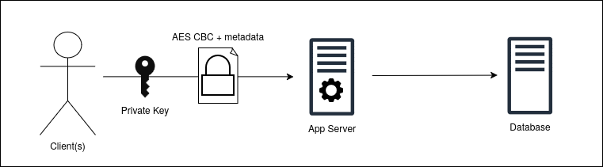
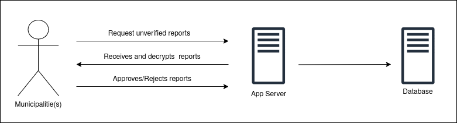
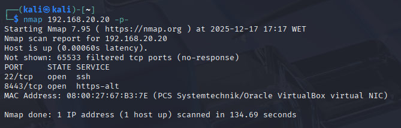
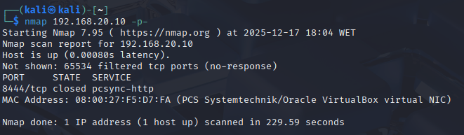
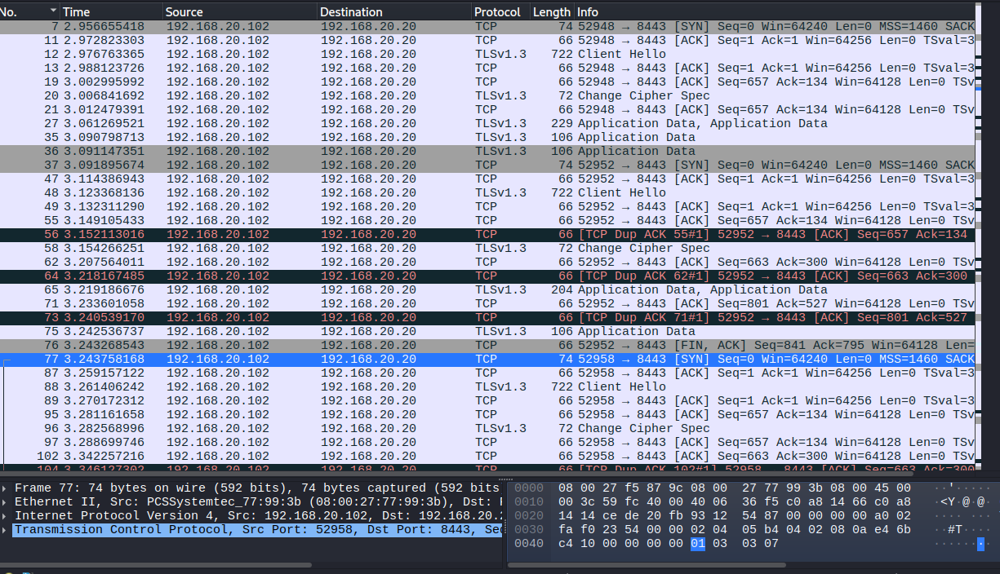
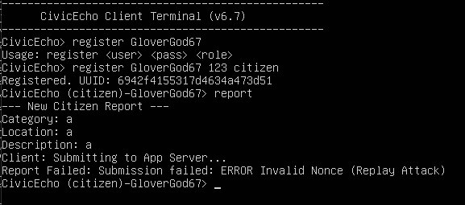
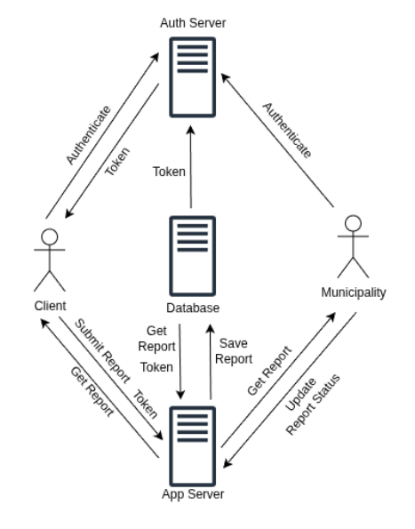

# T19 CivicEcho Project Report

## 1. Introduction

(_Provide a brief overview of your project, including the business scenario and the main components: secure documents, infrastructure, and security challenge._)

CivicEcho is a public participation platform that lets citizens report local issues pseudo-anonymously while enabling municipalities to verify authenticity and avoid spam / disinformation. Reports are JSON documents (example below) that must be shareable between citizens but protected from eavesdropping and tampering.

```json
{
  "report_id": "echo_00218",
  "timestamp": "2025-10-05T14:30:00Z",
  "category": "infrastructure",
  "location": "Lisbon, Portugal",
  "coordinates": {"latitude": 38.72052, "longitude": -9.14583},
  "description": "Broken traffic light on Avenida da Liberdade"
}
```

The system must address the functional security requirements:

- SR1 (Confidentiality): reports cannot be traced back to their author.
- SR2 (Integrity): municipalities must be able to verify that reports were not altered.
- SR3 (Authentication): only verified citizens may submit reports.
- SR4 (Non-repudiation): authorities must be able to verify that a valid report was received.

(_Include a structural diagram, in UML or other standard notation._)

Here is a diagram of our system's design:


## 2. Project Development

### 2.1. Secure Document Format

#### 2.1.1. Design

(_Outline the design of your custom cryptographic library and the rationale behind your design choices, focusing on how it addresses the specific needs of your chosen business scenario._)

(_Include a complete example of your data format, with the designed protections._)

The secure document format for **CivicEcho** was designed to ensure confidentiality, integrity, authentication and non-repudiation.

**Rationale and Design Choices:**

- **Hybrid Encryption (Confidentiality):** We utilized a hybrid encryption scheme to balance performance and flexibility.

- **Symmetric Layer:** The report payload (JSON data containing description, location, etc.) is encrypted using AES (Advanced Encryption Standard) with a randomly generated session key. This ensures efficient encryption of potentially large data.

- **Asymmetric Layer:** The session key is encrypted (wrapped) using **RSA** for each intended recipient. This allows us to target specific users (the author, municipalities, and other citizens) without duplicating the encrypted payload.

**"Encrypt for All, Reveal by Policy" Strategy:** A key design decision was to encrypt the document for all system users (citizens and municipalities) at the moment of creation.

- The file is encrypted on creation and the secret key used is encrypted for each user with their own public key, this way the users can decrypt it later using their private key. We use server side logic at the application level to ensure only authorized users can access the reports.

- This secret key sharing method doesn't scale well but since our application is not expected to have more than 3-4 users at a time we kept it for simplicity. Another method we considered later was to use the database as a centralized key management system, where the client would send the secret securely through TLS to the database, this way only the reference to that key would need to be sent with the report.

**Digital Signatures (Integrity & Non-Repudiation):** To prevent tampering and ensure non-repudiation, the author signs the encrypted payload and the immutable metadata (author ID, nonce, token) using their private RSA key (`SHA256withRSA`). This guarantees that neither the server nor a municipality can alter the content of a citizen's report without breaking the signature.

The figures below are ilustrations of our designed protections and an example of the data format we adopted.

<p align="center">
  
</p>

<p align="center">
  
</p>

**Data Format Example:**
```
{
  "_id": "String",
  "status": "APPROVED | DECLINED",
  "envelope": {
    "metadata": {
      "author_id": "String",
      "nonce": int,
      "token": "String"
    },
    "recipients": {
      "user_id": "Public Key",
      "user_id": "Public Key"
      // ... entries for all other users
    },
    "ciphertext": "AES Encrypted JSON Payload",
    "signature": "RSA Signature"
  }
}
```


#### 2.1.2. Implementation

(_Detail the implementation process, including the programming language and cryptographic libraries used._)

(_Include challenges faced and how they were overcome._)

**Technology Stack:** The secure library was implemented in **Java**, using the standard `javax.crypto` and `java.security` packages for cryptographic primitives, and **Gson** for JSON serialization/deserialization.

- **Key Management:** RSA keys (2048-bit) are generated for every user upon registration. Public keys are stored locally and in the MongoDB instance, while private keys are kept only locally.

- Encryption Flow: \
  1\. Generate AES Session Key (`KeyGenerator`).

  2\. Fetch public keys for all users via `GET_ALL_USERS`.

  3\. Wrap Session Key (`Cipher.WRAP_MODE`) for each user.

  4\. Sign the concatenation of metadata + recipients + ciphertext.

  5\. Construct the JSON object.

  The process is as shown in the code below:

```java
// Client
private static JsonObject createProtectedEnvelope(JsonObject reportData, String userId,
    long nonce, String currentToken) throws Exception {
  JsonObject metadata = new JsonObject();
  metadata.addProperty("author_id", userId);
  metadata.addProperty("nonce", nonce);
  metadata.addProperty("token", currentToken);

  // 1. Generate AES Session Key (KeyGenerator).
  SecretKey sessionKey = CryptoUtils.generateAESKey();
  byte[] encryptedBytes = CryptoUtils.encrypt(sessionKey, new Gson().toJson(reportData).getBytes());

  JsonObject recipients = new JsonObject();

  List<String> allUsers = getUserIds();

  for (String targetId : allUsers) {
    // 2. Fetch public keys for all users via GET_ALL_USERS.
    PublicKey k = getPublicKeyFromServer(targetId);
    if (k != null) {
      // 3. Wrap Session Key (Cipher.WRAP_MODE) for each user.
      recipients.addProperty(targetId,
          Base64.getEncoder().encodeToString(CryptoUtils.wrapKey(k, sessionKey)));
    }
  }

  JsonObject envelope = new JsonObject();
  envelope.add("metadata", metadata);
  envelope.add("recipients", recipients);
  envelope.addProperty("ciphertext", Base64.getEncoder().encodeToString(encryptedBytes));

  // 4. Sign the concatenation of metadata + recipients + ciphertext
  String dataToSign = metadata.toString() + recipients.toString() + envelope.get("ciphertext").getAsString();
  Signature rsa = Signature.getInstance("SHA256withRSA");
  rsa.initSign(loadLocalPrivateKey(userId));
  rsa.update(dataToSign.getBytes());
  envelope.addProperty("signature", Base64.getEncoder().encodeToString(rsa.sign()));

  return envelope;
}

public static String protectAndSubmit(JsonObject reportData, String userId, String currentToken) throws Exception {
  ...
  JsonObject envelope = createProtectedEnvelope(reportData, userId, nonce, currentToken);

  // 5. Construct the JSON object
  JsonObject root = new JsonObject();
  root.add(reportData.get("report_id").getAsString(), envelope);
  ...
}
```

**Challenges and Solutions:**

1\. **Mutable Metadata Breaking Integrity:**

- _Challenge_: Initially, the `status` field was included inside the signed metadata. When a municipality updated the status from `WAITING` to `APPROVED`, the client's integrity check failed because the hash of the data no longer matched the original signature.

- _Solution_: We refactored the data model to move `status` to the root level of document. This decoupled the server's authority (approving reports) from the user's authority (signing content), ensuring signatures remain valid throughout the report lifecycle.

### 2.2. Infrastructure

#### 2.2.1. Network and Machine Setup

We built a three-tier (Trusted, Partialy-trusted and Untrusted), two-switch topology that keeps fully-trusted database/services in an isolated management segment while exposing only HTTPS application ports to the client/municipality segment.

**Logical view (CIDR and traffic rules)**:

- SW1 (mgmt) – 192.168.10.0/24 – NO DHCP: Static addresses only.
    - Members: MongoDB (10.10), App-Server (10.20), Auth-Server (10.11). A host-only network in VirtualBox; no route to the outside so a compromise on SW2 cannot reach the DB directly;
- SW2 (user) – 192.168.20.0/24 – DHCP 20.100-20.200: Client/municipality VMs attach here.
    - Only ports 8443 (App) and 8444 (Auth) are reachable. Both speak mutual-TLS so un-certificated hosts cannot complete a handshake;
- NAT adapter (on each VM) exists only during provisioning and is disabled before the security demonstration, guaranteeing that all later traffic must traverse the two switches.

**Physical mapping (VirtualBox)**:

| VM Role          | Adapter 1 (provisioning) | Adapter 1 (runtime)  | Adapter 2 (runtime)
| :--------------------: | :----------------: | :-----------: | :-----------: |
| Database | NAT | SW1 static 10.10 | - |
| App server | NAT | SW1 static 10.20  | SW2 static 20.20 |
| Auth server | NAT | SW1 static 10.11  | SW2 static 20.10 |
| Client | NAT | SW2 DHCP 20.x  | - |

**Routing & isolation**:

- No default gateway on any VM as inter-tier traffic must flow through the dual-homed application servers, turning them into policy enforcement points.
- Each server also enforces a default-deny firewall that rejects any packet not explicitly whitelisted (see Table below), shrinking the reachable surface to the exact TLS ports required.
- A one-line test (ping 192.168.10.10) proves the DB is unreachable from the User segment once the demo begins.

| Server | Allowed inbound                                    |
| ------ | -------------------------------------------------- |
| App    | TCP 8443 from 192.168.20.0/24 + 192.168.10.10 (DB) |
| Auth   | TCP 8444 from 192.168.20.0/24 + 192.168.10.10 (DB) |
| DB     | TCP 27017 from 192.168.10.20 & 192.168.10.11 only  |


**Operating-system choice** \
We selected Ubuntu Server 22.04 LTS as the common guest OS because:

- Fast and light operating system.
- Minimal installation image keeps attack surface small (no GUI, no extraneous services).
- Native packages for MongoDB 7.0, OpenJDK 21 and Wireshark simplify automated provisioning.

**Database technology** \
MongoDB was chosen because:

- Schema-less documents map naturally to the JSON envelopes produced by our Java code.
- Native TLS support (X.509 member authentication) lets us reuse the same PKI certificates already generated for the application layer.
- No need for relational database schema.

**Implementation language** \
Java was used for three practical reasons:

- All SIRS laboratory exercises were delivered in Java, giving the team a common baseline.
- javax.crypto and java.security provide complete and bullet-proof implementations of AES-CBC, RSA and hashing, shortening the crypto-development cycle.
- Maven offers reproducible builds and transitive-dependency management, essential when the same artifact must run on four different VMs without manual JAR hunting.

(_Provide a brief description of the built infrastructure._)

(_Justify the choice of technologies for each server._)

#### 2.2.2. Server Communication Security

**Goal**
The system employs a layered security model to protect data in transit, ensuring confidentiality and integrity across two distinct communication boundaries: the internal infrastructure and external client access. All channels utilize **TLS 1.3** to guarantee forward secrecy and strong encryption suites.

#### A. Internal Infrastructure (Mutual TLS)

**Scope:** `App Server <-> Database` and `Auth Server <-> Database`.

**Mechanism:**
Communication within the server backend is secured using **Mutual TLS (mTLS)**. In this setup, both the client (App/Auth Server) and the service (Database) must present a valid X.509 certificate to prove their identity before a connection is established.

- **Access Control:** The Database does not rely solely on passwords. It rejects any connection attempt at the socket layer if the connecting peer cannot present a certificate signed by our internal **Root CA**.
- **Spoofing Prevention:** Servers cannot impersonate one another because their IP addresses are embedded in the `Subject Alternative Name (SAN)` field of their certificates.

#### B. Client-Server Access (One-Way TLS)

**Scope:** `Client <-> App Server` and `Client <-> Auth Server`.

**Mechanism:**
Communication between the Client (Citizen/Municipality) and the Servers uses **One-Way TLS** (Server Authentication).

1. **Server Identity (The Handshake):** When a client connects, the Server presents its certificate (e.g., `app-server.crt`). The client verifies this certificate against its local `server_truststore.jks`, which contains the system's Root CA. This guarantees the client is talking to the legitimate CivicEcho server and not a malicious proxy (Man-in-the-Middle).
2. **Client Identity (Application Layer):** Since distributing unique X.509 certificates to every citizen is impractical, the client does _not_ use mTLS. Instead, the secure TLS tunnel is established first. Inside this encrypted tunnel, the client proves their identity using the application-level **Login Protocol** (sending `username` and `password` to receive a session token).

**Key Infrastructure & Distribution**
At system start-up, a private Public Key Infrastructure (PKI) is established. The keys and certificates are distributed as follows:

- **Trust Anchor (Root CA):** A self-signed Certificate Authority (`db-ca.crt`) acts as the root of trust. This file is embedded into a Java TrustStore (`server_truststore.jks`) and distributed to all Java services (App, Auth, Client). It is also configured as the CA file in the MongoDB settings.
- **Server Identities (Private Keys):** Each service possesses a unique private key and a corresponding certificate signed by the Root CA.
- **Java Services (App/Auth):** Stored in PKCS#12 format (`.p12`), containing the key chain.
- **MongoDB:** Stored in PEM format (`db-ca.pem`), concatenating the key and certificate.

- **Distribution:** Certificates are generated on a secure host using a strictly configured OpenSSL script. The resulting artifacts are securely provisioned to the `resources/` folder of each service before the Virtual Machines are launched.

**Implementation Process**
The certificate generation process was scripted to ensure reproducibility and compliance with strict security standards (RFC 5280).

1. **Configuration (san.cnf):** We defined a custom OpenSSL configuration to enforce Subject Alternative Names (SANs) and critical Key Usage extensions.
2. **Signing Request (CSR):** Each server generated a unique key and a Certificate Signing Request (CSR).
3. **Issuance:** The Root CA signed these requests, embedding the specific IP addresses of the VMs into the certificate extensions.

**Key Generation Commands (Summary):**

```bash
# 1. Create OpenSSL Config (Crucial for Strict Validation)
cat > san.cnf <<EOF
[req]
distinguished_name = req_distinguished_name
req_extensions = v3_req
prompt = no
[req_distinguished_name]
C = PT
O = CivicEcho
CN = CivicEcho-Root-CA
[v3_req]
# Critical flags for CA validity in BoringSSL/Chrome
keyUsage = digitalSignature, keyEncipherment, keyCertSign, cRLSign
extendedKeyUsage = serverAuth, clientAuth
subjectAltName = @alt_names
[alt_names]
IP.1 = 192.168.10.10
IP.2 = 192.168.10.20
IP.3 = 192.168.10.11
IP.4 = 192.168.20.20
IP.5 = 192.168.20.10
DNS.1 = localhost
EOF

# 2. Generate Root CA (db.crt)
openssl req -x509 -nodes -days 365 -newkey rsa:2048 \
  -keyout db-ca.key -out db-ca.crt -config san.cnf

# 3. Create MongoDB Bundle (PEM)
cat db-ca.crt db-ca.key > db-ca.pem

# 4. App Server: Generate & Sign
openssl req -new -nodes -newkey rsa:2048 \
  -keyout app-server.key -out app-server.csr \
  -subj "/C=PT/O=CivicEcho/CN=App-Server" -config san.cnf

openssl x509 -req -in app-server.csr \
  -CA db-ca.crt -CAkey db-ca.key -CAcreateserial \
  -out app-server.crt -days 365 \
  -extensions v3_req -extfile san.cnf

# 5. App Server: Package as PKCS12
openssl pkcs12 -export -in app-server.crt -inkey app-server.key \
  -out app-server.p12 -name app-server \
  -CAfile db-ca.crt -caname root-ca -passout pass:appserverpass

# 6. Auth Server: Generate & Sign
openssl req -new -nodes -newkey rsa:2048 \
  -keyout auth-server.key -out auth-server.csr \
  -subj "/C=PT/O=CivicEcho/CN=Auth-Server" -config san.cnf

openssl x509 -req -in auth-server.csr \
  -CA db-ca.crt -CAkey db-ca.key -CAcreateserial \
  -out auth-server.crt -days 365 \
  -extensions v3_req -extfile san.cnf

# 7. Auth Server: Package as PKCS12
openssl pkcs12 -export -in auth-server.crt -inkey auth-server.key \
  -out auth-server.p12 -name auth-server \
  -CAfile db-ca.crt -caname root-ca -passout pass:authserverpass

# 8. Truststore: Import Root CA
keytool -import -alias civic-echo-ca -file db-ca.crt \
  -keystore server_truststore.jks -storepass changeit -noprompt

```

**Challenges & Solutions**

**Strict Certificate Validation (BoringSSL/Electron):**

- _Challenge:_ While Java clients connected successfully using standard certificates, external administration tools (specifically MongoDB Compass) rejected the connection with `KEY_USAGE_BIT_INCORRECT`. This occurred because the default OpenSSL CA generation does not set the `keyCertSign` flag, which strict SSL libraries require for a certificate to act as a Certificate Authority.
- _Solution:_ We updated the `san.cnf` configuration to explicitly include `keyUsage = keyCertSign`. This ensured the Root CA was mathematically valid for signing other certificates, resolving the compatibility issues.

**Security Result**
The system achieves **end-to-end encryption** with Forward Secrecy (via TLS 1.3 ephemeral keys). An attacker capturing network packets sees only encrypted noise. Furthermore, because we enforce **mutual authentication**, an attacker cannot simply connect to the database to guess passwords, nor can they spoof the database IP, as they lack the private key signed by the Root CA.

(_Discuss how server communications were secured, including the secure channel solutions implemented and any challenges encountered._)

(_Explain what keys exist at the start and how are they distributed?_)

### 2.3. Security Challenge

#### 2.3.1. Challenge Overview

(_Describe the new requirements introduced in the security challenge and how they impacted your original design._)

Our team was given two options for a security challenge to implement, of which we chose option B. This security challenge consisted in the
introduction of a token system for report publication, to prevent users from posting the same report repeatedly, enforced by a separate server.
This new feature required us to create a separate VM to serve as an Authentication Server, which authenticates the user and issues a predefined number of tokens. This meant that the authentication process would no longer be handled by the App Server, but was instead handled by the Auth Server.
Along with this change, we also needed every report consume one token from the user who submitted it.

#### 2.3.2. Attacker Model

(_Define who is fully trusted, partially trusted, or untrusted._)

There are three categories we can define for the trust level of a machine:

- fully trusted
- partially trusted
- untrusted

Starting with the fully trusted, these include all of the machines that can directly manipulate the Database. These belong to the 192.168.10.0/24 network, specifically the Database, the Auth Server and the App Server. \
As for the partially trusted, this category refers to machines that can't directly change the database, but can do some authorized process that will alter it through the Servers. These can be authenticated clients, i.e. clients that registered an account, are currently logged in, and have a valid certificate. It also encompasses all of the municipalities, given the same requirements described before for the clients. They reside in the 192.168.20.0/24 network. \
The untrusted machines are all that aren't authenticated to the app, but have some low-level unauthorized access to the Servers, and thus can be considered attackers.

(_Define how powerful the attacker is, with capabilities and limitations, i.e., what can he do and what he cannot do_)

Getting deeper into defining the attackers. They have a very limited range of operations that they can actually perform. Port scans are possible using nmap and it will retrieve the open ports for the App Server and the Auth Server, which are 8443 and 8444 respectively. 

<p align="center">
    
</p>


<p align="center">
  
</p>

However, sending any traffic to these servers will yield no results. Let's take a look at a concrete example, where an attacker tries to send a report to the App Server. When a client submits a report, its userId is added to the metadata. The metadata is then added to the envelope, and the envelope along with the metadata are signed with the user's private key. This way, the signed data can only be unencrypted with the user's public key, which the server can confirm belongs to an authenticated user and and that the userId added in the metadata is valid, thus providing Authenticity. The process is shown briefly in the code below:

```java
// Client
private static JsonObject createProtectedEnvelope(JsonObject reportData, String userId,
      long nonce, String currentToken) throws Exception {
    JsonObject metadata = new JsonObject();
    metadata.addProperty("author_id", userId);
    ...

    JsonObject envelope = new JsonObject();
    envelope.add("metadata", metadata);
    ...

    String dataToSign = metadata.toString() + recipients.toString() + envelope.get("ciphertext").getAsString();
    Signature rsa = Signature.getInstance("SHA256withRSA");
    rsa.initSign(loadLocalPrivateKey(userId));
    rsa.update(dataToSign.getBytes());
    envelope.addProperty("signature", Base64.getEncoder().encodeToString(rsa.sign()));

    return envelope;
  }
```

In the case of an attacker, it does not have a valid userId, which will lead to the server rejecting the submission either because it can't retrieve the user's public key from the database, since it doesn't exist, or because the signature provided is invalid.

```java
// App Server
private static void processReport(String json) throws Exception {
    ...
    JsonObject inner = envelope.getAsJsonObject(reportId);

    JsonObject meta = inner.getAsJsonObject("metadata");
    String uid = meta.get("author_id").getAsString();
    ...

    // 1. Verify User Exists
    PublicKey pub = db.getUserPublicKey(uid);
    if (pub == null)
      throw new SecurityException("User not found");
    ...

    // 3. Verify Signature
    String data = meta.toString() + inner.get("recipients").toString() + inner.get("ciphertext").getAsString();

    Signature rsa = Signature.getInstance("SHA256withRSA");
    rsa.initVerify(pub);
    rsa.update(data.getBytes());

    if (!rsa.verify(Base64.getDecoder().decode(inner.get("signature").getAsString())))
      throw new SecurityException("Invalid Signature");
}
```

The attacker also has other limitations. In spite of being able to intercept traffic, the attacker cannot actually analyze it in any relevant way, due to the communications between all parties being secure via TLS (See image below).

<p align="center">
  
</p>

Any replay attempts by an attacker, i.e. intercepting a packet and resending it to the server, will not succeed. Our implementation keeps a nonce for every user, and the server will verify if the nonce sent in the report is greater than the one in the database. If not, this indicates a replay attack, and the report is rejected, providing Integrity to our application (See image below).

<p align="center">
  
</p>

This security challenge also brought limitations to the client. Although not considered an attacker, a user could still disturb the server/database by submitting the same report an unlimited amount of times, effectively spamming the server. Our token system, which will be described in the next section, prevents the user from spamming reports by giving it a limited amount of tokens and consuming one token for each report submission.

#### 2.3.3. Solution Design and Implementation

(_Explain how your team redesigned and extended the solution to meet the security challenge, including key distribution and other security measures._)

In order to implement this solution, our team started by creating a new file, <em>AuthServer.java</em>, to handle the authentication logic that was once handled by the App Server. Now, upon registration, the user is given five tokens, of which one will be sent to him by the Auth Server:

```java
// Auth Server
case "REGISTER":
    // REGISTER <user> <pass> <role> <pubkey>
    // Returns: <UUID> <TOKEN>
    if (parts.length == 5) {
        String newId = db.registerUser(parts[1], parts[2], parts[3], parts[4]);
        String token = db.getUserCurrentToken(newId);
        out.println(newId + " " + token);
    } else
        out.println("ERROR Format");
    break;
```

In the context of this project, we assessed that five tokens is sufficient for our purpose, although this can be easily changed to any desired amount. A token is unique, meaning it can only be spent once. Each report submission consumes one token. The number of tokens a user has is tracked by an entry in the database associated to the userId:

```
# Users database schema
Users: {
    userId: {
        "name": "value",
        "password": "value",
        "pubkey": "value",
        "role": "citizen" | "municipality",
        "nonce": "counter"
        "n_tokens": "counter"    # number of tokens left
        "token": "value"         # current token
    }
}
```

In the client side, this functionality remained the same, but instead sending the register and login requests directly to the Auth Server, and the client receives a token upon every authentication if it has any tokens remaining. Upon a report submission, the user's current token is wrapped in the protected envelope along with the reportData, userId and nonce, and it's subsequently sent to the App Server. \
While the client awaits a response, the App Server processes the report, from which it extracts the token. Then, it retrieves the user's current assigned token from the database and compares it to the token sent by the user in the report. In case they aren't the same, this means the user's sent token is no longer valid. Otherwise, it proceeds to verify with the database if the user has any tokens left. If the user has more than 0 tokens, the report is stored in the database, and the App Server replies to the client with "OK".

```java
// App Server
private static void processReport(String json) throws Exception {
    ...
    if (!(db.getUserCurrentToken(uid).equals(token))) {
        System.out.println("DB TOKEN: " + db.getUserCurrentToken(uid));
        System.out.println("USER TOKEN: " + token);
        throw new SecurityException("Invalid token");
        }

    if (db.getUserTokenAmount(uid) <= 0) {
      throw new SecurityException("No more tokens");
    }
}
```

If the report submission was successful, the client can then request a new token to the Auth Server, which will send a request query to the database, which includes consuming the current token and acquiring a new one token that it sends to the client, given that it has any tokens left.

To accomodate this feature, we created a new Virtual Machine, that was assigned the IPv4 address 192.168.20.10 on the interface connecting to Switch 2 and 192.168.10.11 on the interface connecting to Switch 3. The clients can connect directly to the Auth Server, as well as the App Server like before, via Switch 2. The communication entities and the messages they exchange can be seen below:

(_Identify communication entities and the messages they exchange with a UML sequence or collaboration diagram._)

<p align="center">
  
</p>


## 3. Conclusion

(_State the main achievements of your work._) \
We accomplished a pseudo-anonymous application that allows users to submit reports on local issues and municipalities to verify authenticity and prevent spam/disinformation, while providing all four specified protection needs (Confidentiality, Integrity, Authentication and Non-Repudiation). It also prevents spam through the use of tokens and effectively maintains network resilience.

(_Describe which requirements were satisfied, partially satisfied, or not satisfied; with a brief justification for each one._)
Our team's program successfully managed to completely satisfy all the requirements:
- [SR1: Confidentiality] Reports cannot be traced back to the author due to the use of pseudonymous userIds and encrypted report data, ensuring that neither the mediator nor unauthorized parties can access or link report data to a real-world person.
- [SR2: Integrity] Municipalities can verify reports were not altered because each report is digitally signed by the submitting user, allowing any modification to the data to be detected during signature verification.
- [SR3: Authentication] Only verified citizens can submit reports because users must register and authenticate with the system, binding their identity to a cryptographic key pair and valid digital certificates before any report can be accepted.
- [SR4: Non-Repudiation] Authorities are able to verify the validity of received reports by checking the digital signature and metadata, which provides proof that a specific authenticated user submitted the report at a given time.

Other from these, spamming reports is also no longer possible after we implemented the Security Challenge B and permitting users to submit a limited number of reports.
The complete functioning of non-security related features (report submission, report sharing, etc.) of the CivicEcho system as described in the Introduction section were fully secured as well.
 
(_Identify possible enhancements in the future._) \
A few points of improvement have been identified during the development of this application:
- Currently, we give users a fixed amount of tokens that never get replenished. We considered renewing the token count every day or every week instead of having only N tokens to use in the account's lifetime.

(_Offer a concluding statement, emphasizing the value of the project experience._) \
This project helped our team not only understand valuable cybersecurity concepts, but also be able to apply them in a realistic scenario like CivicEcho. The lack of base code and the flexible requirements allowed us to be creative in our solution and design an application from the start with all the needs in mind. Overall, this was a positive experience that prepared us better for our future in this area.

## 4. Bibliography

- [Cryptographic Functions in Java](https://github.com/tecnico-sec/Java-Crypto-Functions)
- [Java-Crypto-Details](https://github.com/tecnico-sec/Java-Crypto-Details)
- [Secure-Documents](https://github.com/tecnico-sec/Secure-Documents)
- [Virtual-Networking](https://github.com/tecnico-sec/Virtual-Networking)
- [Traffic-Analysis](https://github.com/tecnico-sec/Traffic-Analysis)
- [Firewall](https://github.com/tecnico-sec/Firewall)
- [Secure-Sockets-in-action](https://github.com/tecnico-sec/Secure-Sockets-in-action)
---

END OF REPORT

### Generating the certificates

# 1. Create Config for the SERVERS (Mongo, App, Auth)

# These are the machines that need the IP addresses/SANs.

cat > server_san.cnf <<EOF
[req]
distinguished_name = req_distinguished_name
req_extensions = v3_req
prompt = no
[req_distinguished_name]
C = PT
O = CivicEcho
CN = Generic-Server
[v3_req]
keyUsage = keyEncipherment, dataEncipherment
extendedKeyUsage = serverAuth, clientAuth
subjectAltName = @alt_names
[alt_names]
IP.1 = 192.168.10.10
IP.2 = 192.168.10.20
IP.3 = 192.168.10.11
IP.4 = 192.168.20.20
IP.5 = 192.168.20.10
DNS.1 = localhost
EOF

# 2. Create the Root CA (Self-Signed)

# CA does NOT need the IPs. It just needs to be a valid Authority.

openssl req -x509 -nodes -days 3650 -newkey rsa:2048 \
 -keyout db-ca.key -out db-ca.crt \
 -subj "/C=PT/O=CivicEcho/CN=CivicEcho-Root-CA"

# 3. Create PEM bundle for Mongo (Key + Cert)

cat db-ca.crt db-ca.key > db-ca.pem

# 4. Generate & Sign App-Server Cert

openssl req -new -nodes -newkey rsa:2048 \
 -keyout app-server.key -out app-server.csr \
 -subj "/C=PT/O=CivicEcho/CN=App-Server" \
 -config server_san.cnf

openssl x509 -req -in app-server.csr \
 -CA db-ca.crt -CAkey db-ca.key -CAcreateserial \
 -out app-server.crt -days 365 \
 -extensions v3_req -extfile server_san.cnf

openssl pkcs12 -export -in app-server.crt -inkey app-server.key \
 -out app-server.p12 -name app-server \
 -CAfile db-ca.crt -caname root-ca \
 -passout pass:appserverpass

# 5. Generate & Sign Auth-Server Cert

openssl req -new -nodes -newkey rsa:2048 \
 -keyout auth-server.key -out auth-server.csr \
 -subj "/C=PT/O=CivicEcho/CN=Auth-Server" \
 -config server_san.cnf

openssl x509 -req -in auth-server.csr \
 -CA db-ca.crt -CAkey db-ca.key -CAcreateserial \
 -out auth-server.crt -days 365 \
 -extensions v3_req -extfile server_san.cnf

openssl pkcs12 -export -in auth-server.crt -inkey auth-server.key \
 -out auth-server.p12 -name auth-server \
 -CAfile db-ca.crt -caname root-ca \
 -passout pass:authserverpass

# 6. Generate Key & CSR for MongoDB

openssl req -new -nodes -newkey rsa:2048 \
 -keyout mongodb-server.key -out mongodb-server.csr \
 -subj "/C=PT/O=CivicEcho/CN=sirs-database1" \
 -config server_san.cnf

# 7. Sign it with your CA

openssl x509 -req -in mongodb-server.csr \
 -CA db-ca.crt -CAkey db-ca.key -CAcreateserial \
 -out mongodb-server.crt -days 365 \
 -extensions v3_req -extfile server_san.cnf

# 8. Create the PEM bundle (Key + Cert) for MongoDB

cat mongodb-server.key mongodb-server.crt > mongodb-server.pem

# 9. Create Java Truststore

# (Delete old one first to avoid duplicates)

rm -f server_truststore.jks
keytool -import -alias db-ca -file db-ca.crt \
 -keystore server_truststore.jks \
 -storepass changeit -noprompt
