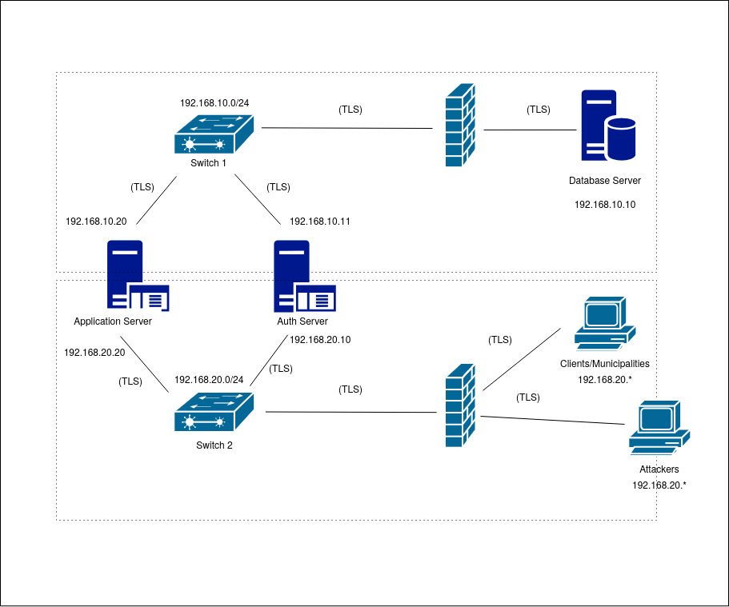

# CXX DeathNode / ChainOfProduct / CivicEcho Project Report

## 1. Introduction

(_Provide a brief overview of your project, including the business scenario and the main components: secure documents, infrastructure, and security challenge._)

(_Include a structural diagram, in UML or other standard notation._)

## 2. Project Development

### 2.1. Secure Document Format

#### 2.1.1. Design

(_Outline the design of your custom cryptographic library and the rationale behind your design choices, focusing on how it addresses the specific needs of your chosen business scenario._)

(_Include a complete example of your data format, with the designed protections._)

#### 2.1.2. Implementation

(_Detail the implementation process, including the programming language and cryptographic libraries used._)

(_Include challenges faced and how they were overcome._)

### 2.2. Infrastructure

#### 2.2.1. Network and Machine Setup

(_Provide a brief description of the built infrastructure._)

(_Justify the choice of technologies for each server._)

#### 2.2.2. Server Communication Security

(_Discuss how server communications were secured, including the secure channel solutions implemented and any challenges encountered._)

(_Explain what keys exist at the start and how are they distributed?_)

### 2.3. Security Challenge

#### 2.3.1. Challenge Overview

(_Describe the new requirements introduced in the security challenge and how they impacted your original design._)

Our team was given two options for a security challenge to implement, of which we chose option B. This security challenge consisted in the 
introduction of a token system for report publication, to prevent users from posting the same report repeatedly, enforced by a separate server.
This new feature required us to create a separate VM to serve as an Authentication Server, which authenticates the user and issues a predefined number of tokens. This meant that the authentication process would no longer be handled by the App Server, but was instead handled by the Auth Server.
Along with this change, we also needed every report consume one token from the user who submitted it.

#### 2.3.2. Attacker Model

(_Define who is fully trusted, partially trusted, or untrusted._)

There are three categories we can define for the trust level of a machine:
 - fully trusted
 - partially trusted
 - untrusted

Starting with the fully trusted, these include all of the machines that can directly manipulate the Database. These belong to the 192.168.10.0/24 network, specifically the Database, the Auth Server and the App Server. \
As for the partially trusted, this category refers to machines that can't directly change the database, but can do some authorized process that will alter it through the Servers. These can be authenticated clients, i.e clients that registered an account, are currently logged in, and have a valid certificate. It also encompasses all of the municipalities, given the same requirements described before for the clients. They reside in the 192.168.20.0/24 network. \
The untrusted machines are all that aren't authenticated to the app, but have some low-level unauthorized access to the Servers, and thus can be considered attackers.

(_Define how powerful the attacker is, with capabilities and limitations, i.e., what can he do and what he cannot do_)

Getting deeper into defining the attackers. They have a very limited range of operations that they can actually perform. Port scans are possible using nmap and it will retrieve the open ports for the App Server and the Auth Server, which are 8443 and 8444 respectively. \
However, sending any traffic to these servers will yield no results. Let's take a look at a concrete example, where an attacker tries to send a report to the App Server. When a client submits a report, it's userId is added to the metadata. The metadata is then added to the envelope, and the envelope along with the metadata are signed with the user's private key. This way, the signed data can only be unencrypted with the user's public key, which the server can confirm belongs to an authenticated user and and that the userId added in the metadata is valid, thus providing Authenticity. The process is shown briefly in the code below:

```java
// Client
private static JsonObject createProtectedEnvelope(JsonObject reportData, String userId,
      long nonce, String currentToken) throws Exception {
    JsonObject metadata = new JsonObject();
    metadata.addProperty("author_id", userId);
    ...

    JsonObject envelope = new JsonObject();
    envelope.add("metadata", metadata);
    ...

    String dataToSign = metadata.toString() + recipients.toString() + envelope.get("ciphertext").getAsString();
    Signature rsa = Signature.getInstance("SHA256withRSA");
    rsa.initSign(loadLocalPrivateKey(userId));
    rsa.update(dataToSign.getBytes());
    envelope.addProperty("signature", Base64.getEncoder().encodeToString(rsa.sign()));

    return envelope;
  }
```

However, in the case of an attacker, it does not have a valid userId, which will lead to the server rejecting the submission either because it can't retrieve the user's public key from the database, since it doesn't exist, or because the signature provided is invalid.

```java
// App Server
private static void processReport(String json) throws Exception {
    ...
    JsonObject inner = envelope.getAsJsonObject(reportId);

    JsonObject meta = inner.getAsJsonObject("metadata");
    String uid = meta.get("author_id").getAsString();
    ...

    // 1. Verify User Exists
    PublicKey pub = db.getUserPublicKey(uid);
    if (pub == null)
      throw new SecurityException("User not found");
    ...

    // 3. Verify Signature
    String data = meta.toString() + inner.get("recipients").toString() + inner.get("ciphertext").getAsString();

    Signature rsa = Signature.getInstance("SHA256withRSA");
    rsa.initVerify(pub);
    rsa.update(data.getBytes());

    if (!rsa.verify(Base64.getDecoder().decode(inner.get("signature").getAsString())))
      throw new SecurityException("Invalid Signature");
}
```

The attacker also has other limitations. In spite of being able to intercept traffic, the attacker can not actually analyze it in any relevant way, due to the communications between all parties being secure via TLS.

Any replay attempts by an attacker, i.e intercepting a packet and resending it to the server, will not succeed. Our implementation keeps a nonce for every user, and the server will verify if the nonce sent in the report is greater than the one in the database. If not, this indicates a replay attack, and the report is rejected, providing Integrity to our application.

This security challenge also brought limitations to the client. Although not considered an attacker, a user could still disturb the server/database by submitting the same report an unlimited amount of times, effectively spamming the server. Our token system, which will be described in the next section, prevents the user from spamming reports by giving it a limited amount of tokens and consuming one token for each report submission.


#### 2.3.3. Solution Design and Implementation

(_Explain how your team redesigned and extended the solution to meet the security challenge, including key distribution and other security measures._)

In order to implement this solution, our team started by creating a new file, <em>AuthServer.java</em>, to handle the authentication logic that was once handled by the App Server. Now, upon registration, the user is given five tokens, of which one will be sent to him by the Auth Server:

```java
// Auth Server
case "REGISTER":
    // REGISTER <user> <pass> <role> <pubkey>
    // Returns: <UUID> <TOKEN>
    if (parts.length == 5) {
        String newId = db.registerUser(parts[1], parts[2], parts[3], parts[4]);
        String token = db.getUserCurrentToken(newId);
        out.println(newId + " " + token);
    } else
        out.println("ERROR Format");
    break;
```

In the context of this project, we assessed that five tokens is sufficient for the purpose of this challenge, although this can be easily changed to any desired amount. A token is unique, meaning it can only be spent once. Each report submission consumes one token. The number of tokens a user has is tracked by an entry in the database associated to the userId:

```
# Users database schema
Users: {
    userId: { 
        "name": "value",
        "password": "value",
        "pubkey": "value", 
        "role": "citizen" | "municipality",
        "nonce": "counter"
        "n_tokens": "counter"    # number of tokens left
        "token": "value"         # current token
    }
}
```

In the client side, this functionality remained the same, but instead sending the register and login requests directly to the Auth Server, and the client receives a token upon every authentication if it has any tokens remaining. Upon a report submission, the user's current token is wrapped in the protected envelope along with the reportData,  userId and nonce, and it's subsequently sent to the App Server. \
While the client awaits a response, the App Server processes the report, from which it extracts the token. Then, it retrieves the user's current assigned token from the database and compares it to the token sent by the user in the report. In case they aren't the same, this means the user's sent token is no longer valid. Otherwise, it proceeds to verify with the database if the user has any tokens left. If the user has more than 0 tokens, the report is stored in the database, and the App Server replies to the client with "OK".

```java
// App Server
private static void processReport(String json) throws Exception {
    ...
    if (!(db.getUserCurrentToken(uid).equals(token))) {
        System.out.println("DB TOKEN: " + db.getUserCurrentToken(uid));
        System.out.println("USER TOKEN: " + token);
        throw new SecurityException("Invalid token");
        }
    
    if (db.getUserTokenAmount(uid) <= 0) {
      throw new SecurityException("No more tokens");
    }
}
```

 If the report submission was successful, the client can then request a new token to the Auth Server, which will send a request query to the database, which includes consuming the current token and acquiring a new one, which it sends to the client, given that it has any tokens left.

 To accomodate this feature, we created a new Virtual Machine, that was assigned the IPv4 address 192.168.20.10 on the interface connecting to Switch 2 and 192.168.10.11 on the interface connecting to Switch 3. The clients can connect directly to the Auth Server, as well as the App Server like before, via Switch 2. The complete network redesign can be seen below:

(_Identify communication entities and the messages they exchange with a UML sequence or collaboration diagram._)

 


## 3. Conclusion

(_State the main achievements of your work._)

(_Describe which requirements were satisfied, partially satisfied, or not satisfied; with a brief justification for each one._)

(_Identify possible enhancements in the future._)

(_Offer a concluding statement, emphasizing the value of the project experience._)

## 4. Bibliography

(_Present bibliographic references, with clickable links. Always include at least the authors, title, "where published", and year._)

---

END OF REPORT

### Generating the certificates

# 1. Create Config for the SERVERS (Mongo, App, Auth)

# These are the machines that need the IP addresses/SANs.

cat > server_san.cnf <<EOF
[req]
distinguished_name = req_distinguished_name
req_extensions = v3_req
prompt = no
[req_distinguished_name]
C = PT
O = CivicEcho
CN = Generic-Server
[v3_req]
keyUsage = keyEncipherment, dataEncipherment
extendedKeyUsage = serverAuth, clientAuth
subjectAltName = @alt_names
[alt_names]
IP.1 = 192.168.10.10
IP.2 = 192.168.10.20
IP.3 = 192.168.10.11
IP.4 = 192.168.20.20
IP.5 = 192.168.20.10
DNS.1 = localhost
EOF

# 2. Create the Root CA (Self-Signed)

# CA does NOT need the IPs. It just needs to be a valid Authority.

openssl req -x509 -nodes -days 3650 -newkey rsa:2048 \
 -keyout db-ca.key -out db-ca.crt \
 -subj "/C=PT/O=CivicEcho/CN=CivicEcho-Root-CA"

# 3. Create PEM bundle for Mongo (Key + Cert)

cat db-ca.crt db-ca.key > db-ca.pem

# 4. Generate & Sign App-Server Cert

openssl req -new -nodes -newkey rsa:2048 \
 -keyout app-server.key -out app-server.csr \
 -subj "/C=PT/O=CivicEcho/CN=App-Server" \
 -config server_san.cnf

openssl x509 -req -in app-server.csr \
 -CA db-ca.crt -CAkey db-ca.key -CAcreateserial \
 -out app-server.crt -days 365 \
 -extensions v3_req -extfile server_san.cnf

openssl pkcs12 -export -in app-server.crt -inkey app-server.key \
 -out app-server.p12 -name app-server \
 -CAfile db-ca.crt -caname root-ca \
 -passout pass:appserverpass

# 5. Generate & Sign Auth-Server Cert

openssl req -new -nodes -newkey rsa:2048 \
 -keyout auth-server.key -out auth-server.csr \
 -subj "/C=PT/O=CivicEcho/CN=Auth-Server" \
 -config server_san.cnf

openssl x509 -req -in auth-server.csr \
 -CA db-ca.crt -CAkey db-ca.key -CAcreateserial \
 -out auth-server.crt -days 365 \
 -extensions v3_req -extfile server_san.cnf

openssl pkcs12 -export -in auth-server.crt -inkey auth-server.key \
 -out auth-server.p12 -name auth-server \
 -CAfile db-ca.crt -caname root-ca \
 -passout pass:authserverpass

# 6. Generate Key & CSR for MongoDB

openssl req -new -nodes -newkey rsa:2048 \
 -keyout mongodb-server.key -out mongodb-server.csr \
 -subj "/C=PT/O=CivicEcho/CN=sirs-database1" \
 -config server_san.cnf

# 7. Sign it with your CA

openssl x509 -req -in mongodb-server.csr \
 -CA db-ca.crt -CAkey db-ca.key -CAcreateserial \
 -out mongodb-server.crt -days 365 \
 -extensions v3_req -extfile server_san.cnf

# 8. Create the PEM bundle (Key + Cert) for MongoDB

cat mongodb-server.key mongodb-server.crt > mongodb-server.pem

# 9. Create Java Truststore

# (Delete old one first to avoid duplicates)

rm -f server_truststore.jks
keytool -import -alias db-ca -file db-ca.crt \
 -keystore server_truststore.jks \
 -storepass changeit -noprompt
